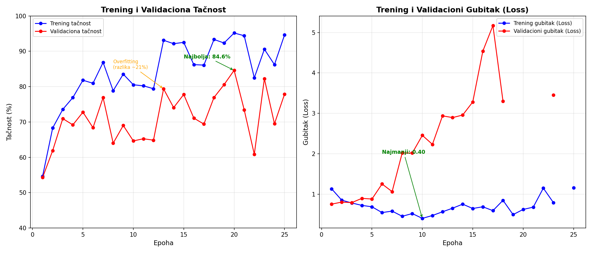

# Klasifikacija MRI snimaka tumora mozga primenom CNN u DeepNetts-u
        
## 1. Opis problema
Cilj projekta je automatska klasifikacija snimaka magnetne rezonance (MRI) mozga u četiri kategorije tumora:
- **Gliom**
- **Meningiom**
- **Tumor hipofize**
- **Bez tumora**

Problem je medicinski značajan jer rana dijagnoza direktno utiče na izbor terapije i ishod lečenja. Ručna analiza MRI snimaka je spora i subjektivna, pa automatizacija pomoću dubokog učenja može značajno pomoći radiolozima.

## 2. Podaci

### Izvor
Dataset je preuzet sa Kaggle-a: [Brain Tumor MRI Dataset](https://www.kaggle.com/datasets/masoudnickparvar/brain-tumor-mri-dataset)

### Struktura
- Originalni dataset: ~7.200 slika (512×512 piksela)
- Korišćeno: **1.200 slika** (300 po klasi, 4 klase) – smanjeno zbog hardverskih ograničenja
- Format: JPG, RGB

### Podela
- Trening: 60% (720 slika)
- Validacija: 10% (120 slika)
- Test: 30% (**360 slika**)

Napomena: U confusion matrici je prikazano 355 test slika zbog interne organizacije DeepNetts-a prilikom evaluacije.

### Preprocesiranje
- Skaliranje na **64×64 piksela** (sa 512×512)
- Strategija: `fitLarger` (zadržava proporcije)
- **Bez augmentacije** – isključeno zbog ograničenja RAM-a
- **Bez standardizacije** (zeroMean=false) – tehničko ograničenje trenutne verzije DeepNetts-a

## 3. Arhitektura modela

Custom CNN od nule (bez transfer learning-a), ~2.2M parametara:

| Sloj | Detalji |
|------|---------|
| Input | 64×64×3 |
| Conv1 | 3×3, 32 filtera, ReLU |
| MaxPool1 | 2×2, stride 2 |
| Conv2 | 3×3, 64 filtera, ReLU |
| MaxPool2 | 2×2, stride 2 |
| Conv3 | 3×3, 128 filtera, ReLU |
| MaxPool3 | 2×2, stride 2 |
| Flatten | 8.192 |
| FC | 256 neurona, ReLU |
| Output | 4 neurona, Softmax |

- **Loss:** Categorical Cross-Entropy – meri koliko je model siguran u pogrešne odgovore; koristi se za multi-class klasifikaciju
- **Optimizer:** Adam – adaptivni optimizator koji sam prilagođava learning rate za svaki parametar ponaosob
Ova arhitektura je odabrana kao optimalna nakon više treniranja na drugim strukturama.
Tri konvoluciona bloka sa rastućim brojem filtera (32 → 64 → 128) omogućavaju modelu da prvo detektuje osnovne karakteristike (ivice, uglove), zatim složenije oblike, i na kraju kompleksne strukture tumora. MaxPooling posle svakog bloka smanjuje dimenzionalnost i zadržava samo najizraženije signale.
## 4. Trening

### Hiperparametri
| Parametar | Vrednost |
|-----------|----------|
| Learning Rate | 0.0001 |
| Max Epochs | 25 |
| Patience | 8 |
| Min Delta | 0.001 |
| Batch Mode | Isključen |
| Train/Val/Test | 60/10/30 |

### Tok treninga
Trening je trajao **77 minuta** (25 epoha) na AMD Ryzen 5 CPU laptopu.

| Epoha | Train Acc | Val Acc | Train Loss |
|-------|-----------|---------|------------|
| 1 | 54.7% | 54.3% | 1.13 |
| 5 | 81.8% | 72.8% | 0.69 |
| 7 | 86.9% | 76.9% | 0.58 |
| 13 | 93.1% | 79.4% | 0.66 |
| 20 | 95.2% | 84.6% | 0.62 |
| 25 | 94.6% | 77.9% | 1.16 |

Na grafikonu se uočava nekoliko ključnih trenutaka:
- **Overfitting** je vidljiv već od 6. epohe – trening tačnost nastavlja da raste (80% → 95%), dok validaciona tačnost osciluje i ne prati taj rast
- **Najbolja validaciona tačnost (84.6%)** postignuta je u 20. epohi
- **Numerička nestabilnost** se javlja od 19. epohe – validacioni gubitak (Loss) pokazuje izražene oscilacije sa izletima ka beskonačnosti, što sugeriše trenutnu nestabilnost optimizatora u prostoru težina
- Model se uprkos nestabilnosti **oporavlja** u 23. epohi (Val Acc 82.2%), što pokazuje robusnost arhitekture i sposobnost Adam optimizatora da se vrati u stabilan režim rada

## 5. Analiza osetljivosti i hiperparametarska optimizacija

Kroz više iteracija treninga testirani su različiti hiperparametri:

| Pokušaj | LR | Patience | MaxEpochs | Slike (ukupno) | Rezultat |
|---------|-----|----------|-----------|----------------|----------|
| 1 | 0.001 | 2 | 100 | 5.600 (128×128) | Val Acc 67% – previše RAM-a |
| 2 | 0.001 | 2 | 100 | 5.600 (64×64) | Val Acc 79.2% – numerička nestabilnost u epoch 8 |
| 3 | 0.0005 | 6 | 30 | 1.200 (128×128) | Val Acc 5.9% – divergirao |
| 4 | 0.0005 | 8 | 25 | 1.200 (64×64) | Val Acc 75.5% – overfitting |
| **5 (finalni)** | **0.0001** | **8** | **25** | **1.200 (64×64)** | **Val Acc 84.6%, Test 73.9%** |

Napomena: Broj slika u tabeli odnosi se na ukupan broj slika (sve 4 klase zajedno). U finalnom pokušaju korišćeno je 300 slika po klasi (ukupno 1.200).

Ključni zaključci:
- Smanjenje LR sa 0.001 na 0.0001 stabilizovalo je trening
- Povećanje Patience-a sa 2 na 8 sprečilo je prerano zaustavljanje
- Smanjenje ukupnog broja slika sa 5.600 na 1.200 smanjilo je opterećenje RAM-a

## 6. Rezultati evaluacije

- **Test Accuracy (73.9%)** – udeo tačno klasifikovanih slika u test skupu. Model je tačan u približno 3 od 4 slučaja.
- **Precision (85%)** – kada model predvidi određenu klasu, u 85% slučajeva je zaista u pravu.
- **Recall (85%)** – od svih slika koje pripadaju jednoj klasi, model ih uspešno prepozna 85%.
- **F1 Score (85%)** – harmonijska sredina preciznosti i odziva; pokazuje balansiran model bez pristrasnosti ka jednoj klasi.

### Confusion Matrix (355 test slika)

| Actual ↓ / Predicted → | Glioma | Meningioma | No Tumor | Pituitary |
|--------------------------|--------|------------|----------|-----------|
| Glioma                   | 92     | 7          | 0        | 0         |
| Meningioma               | 16     | 60         | 2        | 5         |
| No Tumor                 | 2      | 6          | 77       | 0         |
| Pituitary                | 7      | 9          | 0        | 77        |

Zbir: 92+7+16+60+2+5+2+6+77+7+9+77 = 355 test slika

### Tačnost po klasama
- Glioma: **92.9%** (92/99)
- No Tumor: **90.6%** (77/85)
- Pituitary: **82.8%** (77/93)
- Meningioma: **72.3%** (60/83)

### Poređenje sa referentnim modelima (isti dataset, Validation Accuracy)

| Model | Params | Image Size | Hardware | Val Acc | Izvor |
|-------|--------|------------|----------|----------|-------|
| EfficientNetB0 (Transfer) | 4.2M | 224×224 | GPU | 82.4% | [Kaggle](https://www.kaggle.com/code/hakim11/brain-mri-classification) |
| **Ovaj CNN (od nule)** | **2.2M** | **64×64** | **CPU** | **84.6%** | – |
| GoogLeNet (Transfer) | 6.8M | 224×224 | GPU | 86.7% | [Kaggle](https://www.kaggle.com/code/hakim11/brain-mri-classification) |

Napomena: Referentni modeli su trenirani na celom datasetu (7.200 slika) sa 224×224 rezolucijom i augmentacijom, dok je ovaj CNN treniran na podskupu od 1.200 slika sa 64×64 rezolucijom i bez augmentacije. Iako poređenje nije potpuno "apples-to-apples", rezultati pokazuju da se i sa značajno skromnijim resursima mogu postići konkurentne performanse.

## 7. Diskusija

### Postignuto
- CNN od nule postigao je **84.6% Val Acc** na CPU-u – konkurentne performanse u odnosu na značajno veće modele sa transfer learning-om i GPU hardverom
- Klase glioma i bez tumora se prepoznaju sa preko 90% tačnosti
- Precision i recall od 85% pokazuju balansiran model bez pristrasnosti ka jednoj klasi

### Ograničenja
- 64×64 rezolucija zadržava samo ~1.5% originalnih piksela (sa 512×512)
- Zbog malog skupa podataka (300 slika po klasi), model je skloniji pamćenju šuma nego generalizaciji, što objašnjava razliku između trening i test tačnosti (95% vs 73.9%)
- Bez augmentacije, model pokazuje znake overfitting-a
- Numerička nestabilnost u kasnijim epohama – validacioni Loss povremeno odlazi u beskonačnost, što ukazuje na potrebu za dodatnim tehnikama stabilizacije
- Meningiom se najviše meša sa gliomom (16 od 83 slučaja) – ove dve klase su i klinički slične

### Predlozi za poboljšanje
- Povećati rezoluciju na 128×128 ili 224×224
- Dodati augmentaciju (flip, rotacija) i Batch Normalization za stabilizaciju treninga
- Koristiti grayscale umesto RGB (MRI snimci su prirodno crno-beli)
- Gradient clipping za sprečavanje numeričke nestabilnosti
- Povećati broj slika (vratiti svih 7.200)

## 8. Zaključak

CNN model istreniran u DeepNetts-u uspešno klasifikuje MRI snimke tumora mozga u 4 kategorije sa **73.9% test tačnosti** i **85% precision/recall**. Model je pokazao visoku tačnost za gliom (92.9%) i zdrave mozgove (90.6%).

Rezultati pokazuju da je moguće trenirati konkurentne CNN modele u Java ekosistemu koristeći CPU-only pristup. CNN od nule sa samo 2.2M parametara, treniran na laptopu, postiže uporedive performanse sa značajno većim modelima koji koriste transfer learning i GPU hardver.

DeepNetts omogućava **on-premise AI** – podaci ostaju u lokalnoj mreži, ne šalju se na cloud. Ovo je posebno važno za medicinske ustanove gde privatnost pacijenata i sigurnost podataka ne smeju biti ugroženi. Sve se izvršava na postojećem hardveru, unutar Java ekosistema, bez potrebe za skupim GPU serverima ili Python stack-om.

## Kako reprodukovati

### 1. Preuzimanje repozitorijuma
git clone https://github.com/ZoranV3455/brain-tumor-mri-cnn-deepnetts.git
cd brain-tumor-mri-cnn-deepnetts

### 2. Preuzimanje dataseta
Skinuti dataset sa Kaggle-a (https://www.kaggle.com/datasets/masoudnickparvar/brain-tumor-mri-dataset) i raspakovati ga.

### 3. Otvaranje projekta
- Instalirati DeepNetts (https://www.deepnetts.com/download)
- Pokrenuti deepnettsplatform64.exe
- File → Open Project → izabrati klonirani folder
- Po potrebi, u fajlu Data Sets/NewImageDataset.properties podesiti putanju dataSet.imageDir tako da pokazuje na preuzeti Training folder sa slikama

### 4. Pokretanje treninga
- Kliknuti Run (zelena strelica) u toolbar-u
- Trening traje ~77 minuta (25 epoha) na CPU-u
- Model će biti sačuvan u Trained Models/ folderu

### 5. Korišćenje već istreniranog modela
Ako ne želite da trenirate ponovo, već istrenirani model se nalazi u:
Trained Models/deepNetwork300.dnet

**Zoran Vladisavljević, 2026/0206**  
Predmet: Duboko učenje i neuronske mreže  
Prof. dr Zoran Ševarac  
Fakultet organizacionih nauka, Univerzitet u Beogradu  
2026.

